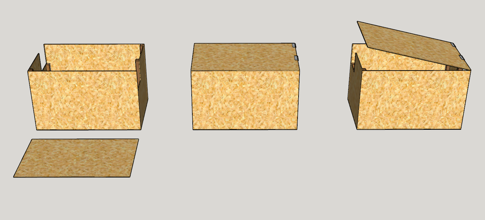
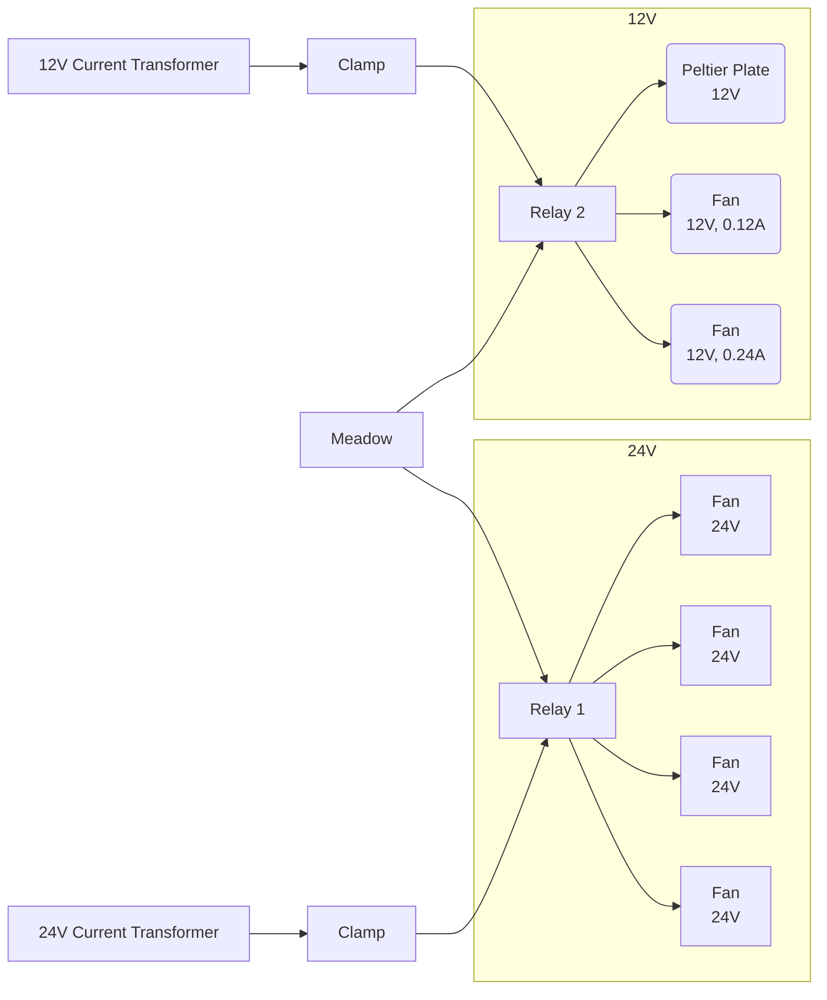

# Software Systems Group 1

## Physical Design

Within the `design` directory, you will find the SketchUp model files:
- `box_model.skp` for the primary structure of the box
- `lid_stop.skp` for the right side of the lid stop mechanism
- `lid_stop_left.skp` for the left side of the lid stop mechanism

These models are provided in both SketchUp format and STL (Stereolithography) format for 3D printing and rendering.

*Note: The image above is a representation of the box design. To view the design in full detail, please access the SketchUp files in the `design` folder.*

## Electrical Architecture

Below is a Mermaid.js diagram illustrating the various connections within the hardware system necessary for its operation. It outlines the relationships between the power supplies, relays, peltier plate, and fans, as well as their connection to the Meadow.

